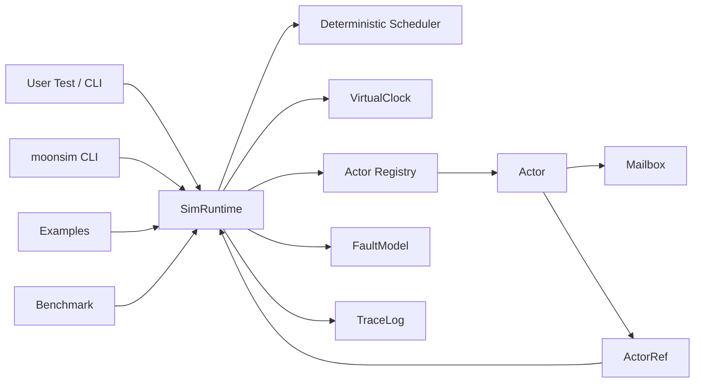

# MoonSim Actors 逻辑视图

逻辑视图描述系统的核心抽象、模块关系和领域模型。

## 核心概念

| 概念 | 说明 |
| --- | --- |
| `Actor` | 拥有私有状态，通过消息驱动行为的计算单元。 |
| `ActorRef` | actor 的外部引用，只暴露发送消息能力。 |
| `Mailbox` | actor 的消息队列，隔离消息发送和处理。 |
| `Message` | actor 间传递的数据，建议保持不可变语义。 |
| `Ask` | 请求-响应模式，带 request id 和 timeout。 |
| `Tell` | 单向消息发送，不等待响应。 |
| `Supervisor` | actor 生命周期和失败处理策略。 |
| `SimRuntime` | 确定性模拟运行时，统一调度 actor、时间和事件。 |
| `VirtualClock` | 虚拟时间源，支持定时器和超时。 |
| `FaultModel` | 故障注入模型，如延迟、丢包、乱序、暂停。 |
| `TraceLog` | 可重放事件日志，记录 seed、调度步骤和消息流。 |

## 模块关系



## 建议包结构

```text
types.mbt
runtime.mbt
demo.mbt
moonsim_wbtest.mbt
cmd/
  moonsim/
    main.mbt
bench/
  mailbox/
    main.mbt
examples/
  kv_cluster/
    main.mbt
docs/
  scenarios-view.md
  logical-view.md
  development-view.md
  process-view.md
  physical-view.md
```

## 第一阶段 API 草案

以下是表达设计意图的伪代码，具体语法以后续 MoonBit 实现为准。

```moonbit
struct ActorRef[T] {
  id : ActorId
}

trait Actor[M] {
  fn receive(self : Self, ctx : ActorContext[M], msg : M) -> Unit
}

struct SimRuntime {
  seed : UInt64
}

fn SimRuntime::spawn[M](self : SimRuntime, actor : Actor[M]) -> ActorRef[M]

fn ActorRef::tell[M](self : ActorRef[M], msg : M) -> Unit

fn ActorRef::ask[M, R](
  self : ActorRef[M],
  msg : M,
  timeout_ms : Int
) -> Result[R, AskError]

fn SimRuntime::run(self : SimRuntime, scenario : fn() -> Unit) -> SimReport
```

## 逻辑约束

- actor 状态只能由自身消息处理逻辑修改。
- 外部只能通过 `ActorRef` 发送消息。
- 模拟运行时是消息、时间和故障的唯一入口。
- 随机行为必须来自 runtime seed，不能直接调用非确定性随机源。
- trace log 记录的是逻辑事件，不依赖机器时间。

## MVP 范围

MVP 必须完成：

- `ActorRef.tell`
- `ActorRef.ask` with timeout
- mailbox
- actor spawn/stop
- virtual clock
- deterministic scheduler with seed
- trace log
- delay/drop/reorder fault model
- KV cluster 或 task queue 示例

MVP 可以暂缓：

- 完整监督树。
- remote actor。
- 分布式网络协议。
- 多线程运行时。
- 图形化 trace viewer。
- 高级 property based testing。
