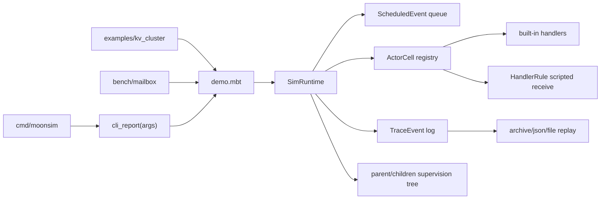

# MoonSim Actors 逻辑视图

逻辑视图描述当前实现中的核心抽象、状态关系和模块边界。

## 核心概念

| 概念 | 说明 |
| --- | --- |
| `ActorRef` | actor 的外部引用，只暴露 `tell/ask/typed` 等交互入口。 |
| `TypedActorRef[T]` | 类型化消息适配器，由调用者提供 encoder，将自定义类型映射为模拟 payload。 |
| `Envelope` | 运行时内部消息信封，包含 from/to、payload、request id 和 reply 标记。 |
| `ActorCell` | runtime 内部 actor 状态，包含生命周期、mailbox、父子关系、KV 状态和 scripted rules。 |
| `ActorKind` | actor 行为：`Sink`、`Echo`、`KvLeader`、`KvFollower`、`Scripted`。 |
| `HandlerRule` | 用户可配置 receive rule，由 matcher 和 action 组成。 |
| `SimRuntime` | 调度、虚拟时间、故障注入、监督树、trace 和 replay 的唯一状态入口。 |
| `FaultRule` | 消息入队时应用的延迟、丢弃或乱序规则。 |
| `TraceEvent` | 稳定逻辑事件，用于文本 archive、JSON 输出和 replay 校验。 |
| `BenchSummary` | benchmark 结构化指标，支持 text、Markdown、JSON 渲染。 |

## 模块关系



## 主要 API

```moonbit
let sim = SimRuntime::new(42)
let cache = sim.spawn_scripted_actor("cache", [
  HandlerRule::{ matcher: MatchPrefix("set "), action: PutFromParts(1, 2) },
  HandlerRule::{ matcher: MatchPrefix("get "), action: GetFromParts(1) },
])
cache.tell(sim, "set token abc")
sim.run_all(16)
println(ask_result_text(cache.ask(sim, "get token", 10)))
println(sim.trace_json())
```

## 边界原则

- `runtime.mbt` 管调度和状态，不负责命令行展示。
- `demo.mbt` 管场景、benchmark 和报告渲染。
- `cli.mbt` 只做参数解析和分发。
- scripted handler 是数据驱动规则，降低和用户业务代码的耦合。
- `TypedActorRef[T]` 保持旧 `String` payload 兼容，同时给上层自定义类型留入口。
