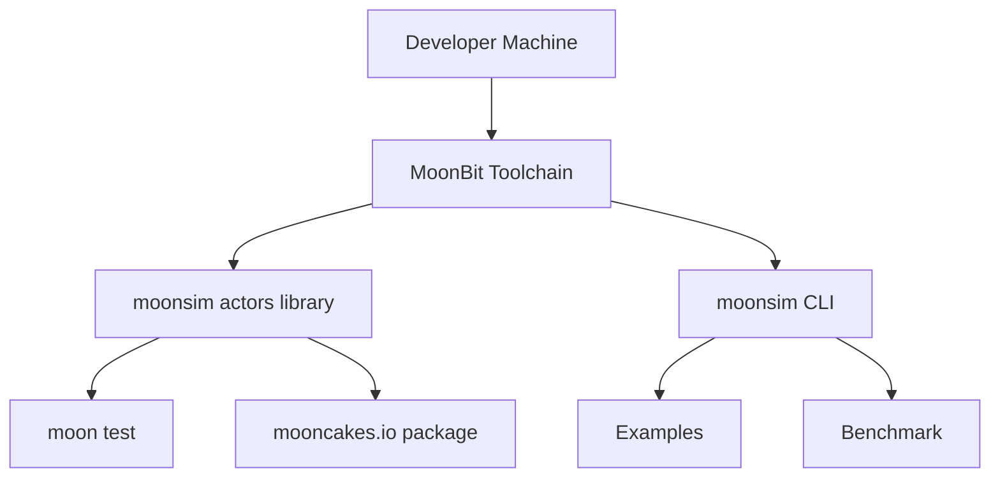

# MoonSim Actors 物理视图

物理视图描述部署、运行目标、外部依赖和可交付产物。

## 第一阶段部署形态

## 运行目标

| 目标 | 优先级 | 说明 |
| --- | --- | --- |
| Native backend | P0 | 第一阶段主要支持目标。 |
| JS backend | P2 | 可探索，但不作为验收核心。 |
| Wasm backend | P3 | 第一阶段不承诺。 |

## 外部依赖

优先减少外部依赖，便于比赛验收和发布：

- MoonBit toolchain。
- MoonBit async 能力。
- MoonBit 测试框架。
- Mooncakes 包发布平台。

## 产物

- MoonBit library：actor、sim、fault、trace。
- CLI binary：运行示例、benchmark、replay。
- 示例工程：KV cluster 或任务队列。
- 测试套件：单元测试、异步测试、确定性测试。
- 文档：架构、API、快速开始、比赛申报。
- 发布包：mooncakes.io。

## 物理约束

- 第一阶段所有测试在本机单进程运行。
- 逻辑事件不依赖 wall-clock time。
- trace 文件需要能跨机器复现。
- CLI 输出格式应尽量稳定，方便后续接入 CI。
- benchmark 数据需要记录 MoonBit 版本、运行目标和平台信息。

## 风险和应对

| 风险 | 影响 | 应对 |
| --- | --- | --- |
| MoonBit async API 仍在演进 | API 变动导致返工 | 核心接口封装在 runtime 层，避免到处直接依赖 async 细节。 |
| Actor 框架范围膨胀 | 无法按时验收 | 第一阶段只做 tell、ask、timeout、Stop/Restart。 |
| 确定性调度难度高 | replay 不稳定 | 所有随机来源统一 seed，禁止真实时间参与逻辑。 |
| CLI 和 benchmark 分散精力 | 核心库不稳 | CLI 只做 run/replay/bench 三个最小命令。 |
| 示例过复杂 | 展示不清楚 | 第一示例选 KV cluster 或 task queue，状态和 invariant 明确。 |

