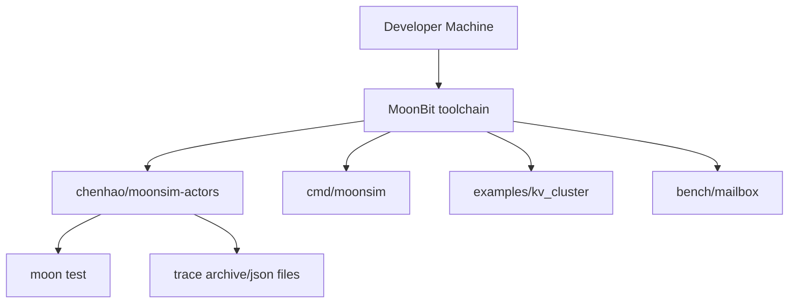

# MoonSim Actors 物理视图

物理视图描述项目如何运行、依赖哪些外部工具，以及最终交付物形态。

## 部署形态

## 外部依赖

- MoonBit toolchain。
- MoonBit core library：`env`、`bench`、`json`、`Map`、`Array`、`String`。
- `moonbitlang/x/fs`：trace 文件读写。
- MoonBit 测试框架。

## 产物

- MoonBit library：actor、runtime、fault、supervisor、trace/replay。
- CLI：`cmd/moonsim`，支持 run/bench/replay/trace。
- 示例：`examples/kv_cluster`。
- benchmark：`bench/mailbox`。
- 文档：README、TODO、4+1 架构视图、发布说明、比赛申报草稿。
- LICENSE：Apache-2.0。

## 发布准备

`moon.mod` 已包含：

- package name：`chenhao/moonsim-actors`
- version：`0.1.0`
- readme：`README.md`
- repository：`https://github.com/chenh735/MoonSim-Actors`
- license：`Apache-2.0`
- keywords 和 description

真实发布前请确认仓库已推送到 GitHub，并按 `docs/mooncakes-publish.md` 执行。
