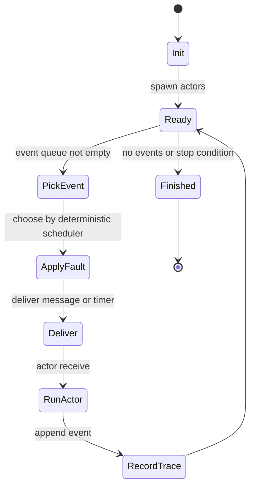
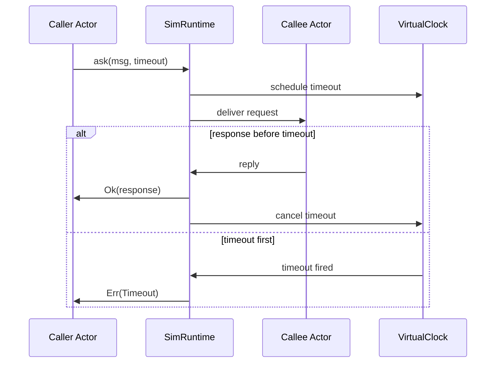
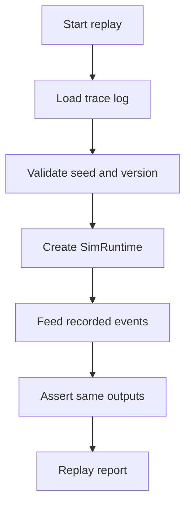

# MoonSim Actors 进程视图

进程视图描述运行时行为、并发模型和关键动态关系。

## 运行模型

第一阶段推荐单进程、单模拟运行时、确定性事件循环：



## 事件类型

| 事件 | 说明 |
| --- | --- |
| `ActorSpawned` | 创建 actor。 |
| `ActorStopped` | actor 正常停止。 |
| `ActorFailed` | actor 处理消息失败。 |
| `MessageSent` | 消息进入 runtime。 |
| `MessageDelivered` | 消息投递到 mailbox 或 actor。 |
| `MessageDropped` | 故障模型丢弃消息。 |
| `TimerScheduled` | 创建虚拟时间定时器。 |
| `TimerFired` | 定时器触发。 |
| `NodePaused` | actor 或节点暂停。 |
| `NodeResumed` | actor 或节点恢复。 |

## 调度原则

- 所有待处理事件进入统一 event queue。
- scheduler 通过 seed 和当前状态选择下一个事件。
- fault model 在事件投递前决定 delay/drop/reorder。
- virtual clock 只在 runtime 决定时推进。
- actor receive 不直接阻塞真实线程。

## Ask/Timeout 流程



## 失败处理流程

```mermaid
sequenceDiagram
    participant Runtime as SimRuntime
    participant Actor as WorkerActor
    participant Supervisor as Supervisor
    participant Trace as TraceLog

    Runtime->>Actor: deliver message
    Actor-->>Runtime: failed
    Runtime->>Trace: record ActorFailed
    Runtime->>Supervisor: notify failure
    alt Restart
        Supervisor->>Runtime: restart actor
        Runtime->>Trace: record ActorRestarted
    else Stop
        Supervisor->>Runtime: stop actor
        Runtime->>Trace: record ActorStopped
    end
```

## 重放流程



## 并发边界

第一阶段不追求多线程并发执行。系统应优先保证确定性、可测试和可重放。

- actor 可以表达异步逻辑。
- runtime 内部用确定性事件循环驱动。
- 虚拟时间由 runtime 推进。
- 真实时间只用于 CLI 统计，不参与模拟逻辑。

