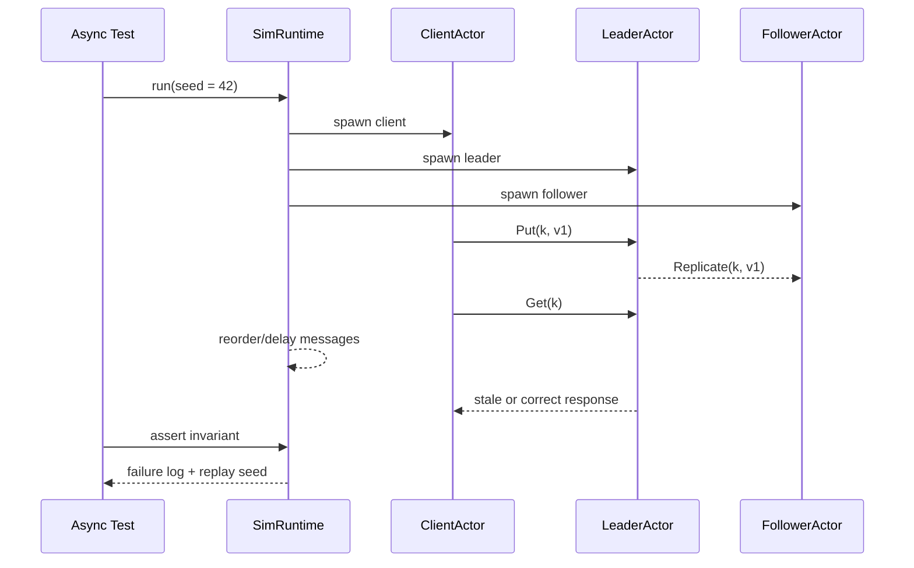

# MoonSim Actors 场景视图

场景视图是 4+1 架构里的 “+1”，用于描述系统为什么存在，以及主要能力如何被真实使用。

项目暂定名：MoonSim Actors

定位：基于 MoonBit 的轻量 Actor 框架与确定性模拟测试工具，用于复现和测试异步后端系统中的消息乱序、延迟、超时、故障恢复和调度问题。

## 核心价值

- 用 Actor 模型组织后端组件状态和消息边界。
- 用确定性调度器让并发问题可以通过 seed 复现。
- 用虚拟时间替代真实 sleep，提升测试速度和稳定性。
- 用故障注入模拟消息延迟、乱序、丢失、节点暂停和恢复。
- 用 CLI、示例服务和 benchmark 展示工程完整性。

## 场景 A：确定性复现消息乱序 bug

开发者写了一个 KV actor 集群 demo。某些请求在消息乱序时会出现 stale read。使用 MoonSim Actors 后，可以用固定 seed 复现失败。



验收点：

- 同一个 seed 下执行顺序稳定。
- 失败时输出 seed、事件序列、最后若干条消息。
- 用户可以用相同 seed 重放问题。

## 场景 B：测试 actor 超时和重试逻辑

开发者通过 `ask` 发送请求，并设置 timeout。模拟器可以让响应延迟超过虚拟时间阈值，验证重试路径。

验收点：

- 支持虚拟时间 `sleep` / `timeout`。
- timeout 不依赖真实时间。
- 测试运行速度稳定，不因机器负载明显波动。

## 场景 C：验证 actor 崩溃后的监督策略

Actor 处理异常消息时失败，Supervisor 按策略重启 actor。第一阶段只实现最小策略：`Stop`、`Restart`。

验收点：

- actor 失败事件可观察。
- supervisor 可以按策略处理失败。
- 重启后的 actor 状态清晰可测。

## 场景 D：CLI 运行示例和 benchmark

用户通过 CLI 跑 demo 或 benchmark，快速理解项目能力。

```text
moonsim run examples/kv_cluster --seed 42 --trace
moonsim bench mailbox --messages 100000
moonsim replay trace/moonsim-seed-42.json
```

验收点：

- CLI 能运行至少一个示例。
- CLI 输出 seed、结果摘要、耗时、事件数量。
- benchmark 能生成简单 Markdown 或 JSON 报告。

## MVP 场景优先级

| 优先级 | 场景 | 说明 |
| --- | --- | --- |
| P0 | 确定性复现消息乱序 bug | 最能体现项目辨识度。 |
| P0 | 测试超时和重试逻辑 | 后端异步系统常见需求。 |
| P1 | CLI 运行示例和 replay | 便于评审快速理解。 |
| P1 | actor 崩溃后的监督策略 | 第一阶段只做最小策略。 |

